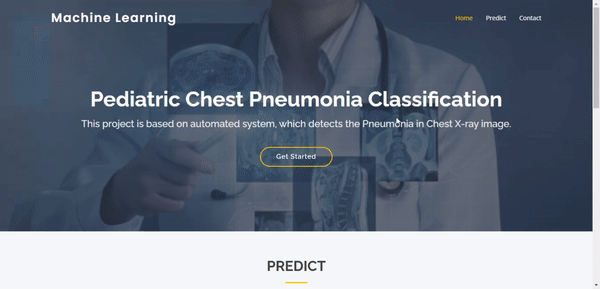

# Pediatric Chest Pneumonia Classification: Leveraging Traditional CNN with GAN for Data Balancing

[](https://huggingface.co/spaces/AbdulManaf12/Pediatric-Chest-Xray-Pneumonia-Classification-System)
[](http://abdulmanaf12.pythonanywhere.com/)
[](https://www.kaggle.com/datasets/paultimothymooney/chest-xray-pneumonia)

## Abstract

This project presents an innovative approach to pediatric chest pneumonia classification using deep learning techniques. We address the critical challenge of class imbalance in medical imaging datasets by employing Generative Adversarial Networks (GANs) for synthetic data generation, combined with traditional data augmentation methods. Our methodology demonstrates significant improvements in classification accuracy and model robustness for pneumonia detection in pediatric chest X-rays.



## Table of Contents

- [Introduction](#introduction)
- [Methodology](#methodology)
- [Dataset](#dataset)
- [Model Architecture](#model-architecture)
- [Experimental Setup](#experimental-setup)
- [Results](#results)
- [Demo](#demo)
- [Installation](#installation)
- [Usage](#usage)
- [Project Structure](#project-structure)
- [Contributing](#contributing)
- [Citation](#citation)
- [License](#license)

## Introduction

Pneumonia is a leading cause of mortality in children under 5 years globally. Early and accurate diagnosis through chest X-ray analysis is crucial for effective treatment. However, medical imaging datasets often suffer from class imbalance, where normal cases significantly outnumber pneumonia cases. This project addresses this challenge by:

1. **Data Balancing**: Using GANs to generate synthetic normal chest X-ray images
2. **Data Augmentation**: Applying traditional augmentation techniques
3. **Deep Learning**: Implementing a CNN architecture optimized for binary classification
4. **Model Evaluation**: Comprehensive comparison across different data balancing strategies

## Methodology

### 1. Data Preprocessing

- **Image Resizing**: All images resized to 148×148 pixels
- **Normalization**: Pixel values normalized to [0,1] range
- **Grayscale Conversion**: Converted to single-channel grayscale images

### 2. Data Balancing Strategies

#### Strategy 1: Traditional Data Augmentation

- Rotation (±35°)
- Width/Height shifts (0.1/0.08)
- Shear transformation (0.2)
- Zoom (0.2)

#### Strategy 2: GAN-based Data Generation

- **Architecture**: Deep Convolutional GAN (DCGAN)
- **Generator**: 4-layer transposed convolution network
- **Discriminator**: 4-layer convolution network
- **Training**: 40,000 iterations with RMSprop optimizer
- **Output**: 2,534 synthetic normal X-ray images

#### Strategy 3: Combined Approach

- Integration of augmented and GAN-generated images
- Comprehensive dataset balancing

### 3. Model Architecture

Our CNN architecture consists of:

- **Convolutional Layers**: Multiple Conv2D layers with ReLU activation
- **Pooling Layers**: MaxPooling2D for dimensionality reduction
- **Normalization**: BatchNormalization for training stability
- **Regularization**: Dropout layers to prevent overfitting
- **Output**: Single sigmoid neuron for binary classification

## Dataset

- **Source**: [Kaggle Chest X-Ray Pneumonia Dataset](https://www.kaggle.com/datasets/paultimothymooney/chest-xray-pneumonia)
- **Total Images**: 5,863 X-ray images
- **Classes**: Normal, Pneumonia
- **Split**: Train (5,216), Validation (16), Test (624)
- **Image Format**: JPEG
- **Resolution**: Variable (resized to 148×148)

### Class Distribution

- **Training Set**:
  - Normal: 1,341 images
  - Pneumonia: 3,875 images
- **Test Set**:
  - Normal: 234 images
  - Pneumonia: 390 images

## Model Architecture

```python
model = Sequential([
    Conv2D(32, (3, 3), input_shape=(148, 148, 1), activation='relu'),
    MaxPooling2D(pool_size=(2, 2)),
    BatchNormalization(),
    Conv2D(64, (3, 3), activation='relu'),
    MaxPooling2D(pool_size=(2, 2)),
    Flatten(),
    Dense(1, activation='sigmoid')
])
```

**Hyperparameters**:

- Optimizer: Adam
- Loss Function: Binary Crossentropy
- Batch Size: 132
- Epochs: 15-50 (varies by experiment)
- Learning Rate: Default Adam (0.001)

## Experimental Setup

We conducted four comprehensive experiments:

1. **Baseline**: Original imbalanced dataset
2. **Augmentation**: Traditional data augmentation
3. **GAN Generation**: Synthetic data generation
4. **Combined**: Augmentation + GAN generation

### Hyperparameter Optimization

- **Convolutional Layers**: [32,64], [32,64,128], [32,64,128,128], [32,64,128,256], [64,128,256,256]
- **Dense Layers**: [], [512], [256], [256,256], [512,256], [512,512]
- **Dropout Rates**: [0.2], [0.5], [0.2,0.2], [0.2,0.5], [0.5,0.5]
- **Batch Normalization**: True/False

## Results

### Performance Metrics

| Experiment            | Accuracy   | Precision | Recall   | F1-Score |
| --------------------- | ---------- | --------- | -------- | -------- |
| Baseline (Imbalanced) | 85.26%     | 0.85      | 0.85     | 0.85     |
| Augmentation          | 86.06%     | 0.86      | 0.86     | 0.86     |
| GAN Generation        | 84.78%     | 0.85      | 0.85     | 0.85     |
| Combined Approach     | **87.18%** | **0.87**  | **0.87** | **0.87** |

### Key Findings

1. **Data Balancing Effectiveness**: Combined approach achieved highest accuracy (87.18%)
2. **GAN Quality**: Generated images maintained realistic chest X-ray characteristics
3. **Model Robustness**: Balanced datasets showed improved generalization
4. **Clinical Relevance**: High recall for pneumonia detection (87%)

## Demo

### Live Demo

- **Hugging Face Space**: [Try the model online](https://huggingface.co/spaces/AbdulManaf12/Pediatric-Chest-Xray-Pneumonia-Classification-System)
- **Web Application**: [http://abdulmanaf12.pythonanywhere.com/](http://abdulmanaf12.pythonanywhere.com/)

### Features

- Real-time chest X-ray classification
- Probability scores for predictions
- User-friendly web interface
- Support for various image formats

## Installation

### Prerequisites

```bash
Python 3.8+
TensorFlow 2.x
OpenCV
Flask
NumPy
Matplotlib
```

### Setup

```bash
# Clone the repository
git clone https://github.com/AbdulManaf12/Pediatric-Chest-Pneumonia-Classification-System.git
cd Pediatric-Chest-Pneumonia-Classification-System

# Install dependencies
pip install -r requirements.txt

# Download the pre-trained model weights
# (weights.h5 should be placed in the static/ directory)
```

## Usage

### Web Application

```bash
python main.py
```

Navigate to `http://localhost:5000` to access the web interface.

### Direct Prediction

```python
from Model import MyModel

# Initialize model
model = MyModel()

# Make prediction (assumes image.png in static/ directory)
prediction, probability = model.predict()
print(f"Prediction: {prediction}, Probability: {probability}")
```

### Training New Models

Run the Jupyter notebooks in the following order:

1. `notebooks/image_generation.ipynb` - GAN training and synthetic data generation
2. `notebooks/Project.ipynb` - Main training pipeline
3. `notebooks/xai_experiment.ipynb` - Explainable AI experiments

## Project Structure

```
├── Model.py                    # CNN model definition and prediction logic
├── main.py                     # Flask web application
├── static/                     # Static files (CSS, images, model weights)
│   ├── weights.h5             # Pre-trained model weights
│   ├── style.css              # Web interface styling
│   └── ...
├── templates/                  # HTML templates
│   ├── index.html             # Main interface
│   └── results.html           # Results page
├── notebooks/                  # Jupyter notebooks
│   ├── Project.ipynb          # Main training pipeline
│   ├── image_generation.ipynb # GAN implementation
│   └── xai_experiment.ipynb   # Explainable AI
├── requirements.txt           # Python dependencies
└── README.md                  # This file
```

## Technical Implementation

### GAN Architecture

**Generator Network**:

```python
Dense(image_resize * image_resize * 128) →
Reshape →
Conv2DTranspose(128) → BatchNorm → ReLU →
Conv2DTranspose(64) → BatchNorm → ReLU →
Conv2DTranspose(32) → BatchNorm → ReLU →
Conv2DTranspose(1) → Sigmoid
```

**Discriminator Network**:

```python
Conv2D(32) → LeakyReLU →
Conv2D(64) → LeakyReLU →
Conv2D(128) → LeakyReLU →
Conv2D(256) → LeakyReLU →
Flatten → Dense(1) → Sigmoid
```

### Data Pipeline

1. **Loading**: Multi-threaded image loading with OpenCV
2. **Preprocessing**: Resize, normalize, convert to grayscale
3. **Augmentation**: Real-time augmentation during training
4. **Generation**: Batch generation of synthetic images
5. **Balancing**: Strategic dataset composition

## Evaluation Metrics

- **Accuracy**: Overall classification correctness
- **Precision**: True positive rate for pneumonia detection
- **Recall**: Sensitivity for pneumonia cases
- **F1-Score**: Harmonic mean of precision and recall
- **Confusion Matrix**: Detailed classification breakdown

## Future Work

1. **Multi-class Classification**: Extend to different types of pneumonia
2. **Advanced Architectures**: Implement ResNet, DenseNet, or Vision Transformers
3. **Federated Learning**: Enable privacy-preserving collaborative training
4. **Real-time Processing**: Optimize for mobile deployment
5. **Clinical Validation**: Collaborate with medical institutions for validation

## Contributing

We welcome contributions! Please see our contributing guidelines:

1. Fork the repository
2. Create a feature branch (`git checkout -b feature/AmazingFeature`)
3. Commit your changes (`git commit -m 'Add some AmazingFeature'`)
4. Push to the branch (`git push origin feature/AmazingFeature`)
5. Open a Pull Request

## Citation

If you use this work in your research, please cite:

```bibtex
@article{manaf2024pediatric,
  title={Pediatric Chest Pneumonia Classification: Leveraging Traditional CNN with GAN for Data Balancing},
  author={Abdul Manaf, Nimra Mughal},
  journal={arXiv preprint arXiv:2024.xxxxx},
  year={2024}
}
```

## Acknowledgments

- Kaggle for providing the chest X-ray pneumonia dataset
- The medical imaging research community
- Open-source contributors to TensorFlow and related libraries

## License

This project is licensed under the MIT License - see the [LICENSE](LICENSE) file for details.

---

**Disclaimer**: This tool is for research and educational purposes only. It should not be used as a substitute for professional medical diagnosis. Always consult with qualified healthcare professionals for medical decisions.
